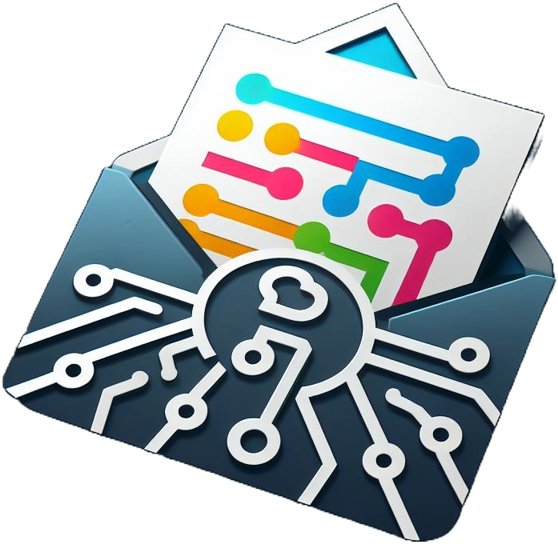

# CodeBand

## Introduction

ChatApp is a real-time messaging application built using Flutter and Firebase. It supports individual and group chats, user authentication, profile management, and more. This app is designed to be a comprehensive solution for modern communication needs.

## Features

- Real-time messaging
- User authentication (sign up, login, logout)
- Group chats
- Offline support

## Screenshots

<div style="display: flex; justify-content: center; gap: 40px">
    
    
    
</div>


## Features I am working on

  - **Code Chatting:**
    Share and edit code live with your team, enhancing collaboration and productivity.

   -  **Profile Management:**
   Update your profile picture and other details.

   - **Push notifications**
    Instant push notification when any changes happen.

## Installation

### Prerequisites

- Flutter SDK: Install Flutter
- Firebase account: Create Firebase Project

### Steps

1. **Clone the repository:**

    ```bash
    git clone https://github.com/bayehyg/chat-app.git
    cd chat-app
    ```

2. **Install dependencies:**

    ```bash
    flutter pub get
    ```

3. **Set up Firebase:**

    - Add `google-services.json` to `android/app`.
    - Add `GoogleService-Info.plist` to `ios/Runner`.

4. **Run the app:**

    ```bash
    flutter run
    ```


## Contact

If you have any questions or suggestions, feel free to open an issue or contact me at bayehyonatan@gmail.com.

---

Thank you for using CodeBand! I hope it enhances your communication experience.